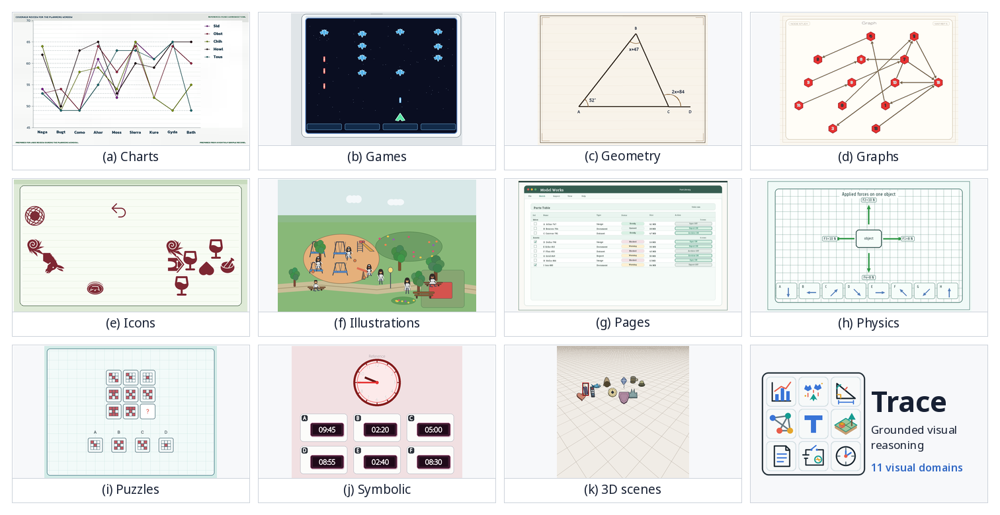
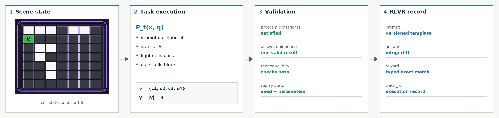

<h1 align="center">
  
</h1>

Trace generates deterministic, grounded visual-reasoning tasks for verifiable
post-training. Each example includes an image, prompt, typed answer,
image-space annotation, verifier metadata, and execution trace. The registry
contains 1,000 tasks across 277 scenes and 11 visual domains.

<p align="center">
  <a href="https://maveryn.github.io/trace/"></a>
  <a href="https://arxiv.org/abs/2607.19790"></a>
  <a href="https://huggingface.co/collections/maveryn/trace-6a604291b4be4ed6399b9f24"></a>
  <a href="https://huggingface.co/datasets/maveryn/trace"></a>
  <a href="https://huggingface.co/maveryn/trace-qwen2.5-vl-3b"></a>
  <a href="https://huggingface.co/maveryn/trace-qwen2.5-vl-7b"></a>
</p>



## How Trace Works

Trace organizes visual reasoning as `domain → scene grammar → task program`.
A deterministic seed instantiates semantic scene state, and the selected task
program executes over that state to derive a unique typed answer and verifier
state. The image and prompt are then rendered from the same underlying state.



This shared-state design keeps generation, supervision, and verification
aligned. Each finalized record contains the rendered problem, exact scoring
contract, image-space annotation, and an execution-trace reference for
inspection and replay.

## TRACE Validation

On 2,000 previously unseen instances generated from the same 1,000 task
programs, TRACE training improves accuracy at both model scales.

| Model scale | Base | TRACE | Change |
| --- | ---: | ---: | ---: |
| Qwen2.5-VL-3B | 24.45 | 41.05 | +16.60 |
| Qwen2.5-VL-7B | 34.25 | 51.55 | +17.30 |

These results measure new realizations within the TRACE task distributions;
the evaluation below measures transfer to external benchmarks.

## External Benchmark Transfer

Qwen2.5-VL models trained on 64,000 Trace instances improve the unweighted
macro-average across 24 external benchmarks at both evaluated model scales.

| Model scale | Base | TRACE | Paired change |
| --- | ---: | ---: | ---: |
| Qwen2.5-VL-3B | 39.34 ± 0.63 | 42.85 ± 0.39 | +3.51 ± 0.25 |
| Qwen2.5-VL-7B | 47.93 ± 0.30 | 51.99 ± 0.17 | +4.06 ± 0.41 |

Values are mean ± sample standard deviation across decoding seeds 42, 43, and
44. Paired changes compare matched benchmark and seed results.

### Base versus TRACE by benchmark

The table reports all 24 external benchmarks for the matched 3B and 7B
comparisons. Parenthesized values are mean seed-paired TRACE-minus-Base changes
in percentage points.

<!-- trace-eval-v1-base-trace-table:start -->
| Benchmark | 3B Base | 3B TRACE (Δ) | 7B Base | 7B TRACE (Δ) |
| --- | ---: | ---: | ---: | ---: |
| **Charts & Tables** |  |  |  |  |
| ChartQAPro | 31.57 ± 0.66 | 31.43 ± 1.33 (-0.14) | 45.81 ± 0.24 | 48.05 ± 0.40 (+2.24) |
| CharXivReason | 28.90 ± 1.11 | 34.67 ± 1.47 (+5.77) | 39.73 ± 1.17 | 47.13 ± 0.35 (+7.40) |
| TableVQABench | 69.27 ± 0.91 | 71.99 ± 0.28 (+2.72) | 75.20 ± 0.90 | 78.31 ± 0.17 (+3.11) |
| EvoChart | 48.51 ± 0.45 | 46.83 ± 1.36 (-1.68) | 57.07 ± 0.72 | 64.91 ± 0.05 (+7.84) |
| **Visual Math** |  |  |  |  |
| MathVision | 19.25 ± 0.65 | 25.35 ± 0.86 (+6.10) | 24.81 ± 0.75 | 27.42 ± 0.62 (+2.61) |
| MathVista | 58.13 ± 3.74 | 64.43 ± 2.12 (+6.30) | 68.67 ± 0.40 | 73.37 ± 0.45 (+4.70) |
| MathVerse | 33.59 ± 1.95 | 40.02 ± 1.52 (+6.43) | 43.44 ± 0.92 | 47.76 ± 0.51 (+4.31) |
| WeMath | 17.87 ± 1.24 | 28.82 ± 0.40 (+10.95) | 35.20 ± 2.92 | 46.16 ± 1.32 (+10.96) |
| **Science & General** |  |  |  |  |
| PhyX mini MC | 32.80 ± 9.96 | 37.47 ± 5.58 (+4.67) | 40.97 ± 3.57 | 48.70 ± 0.82 (+7.73) |
| MMMU-ProVis | 26.59 ± 0.32 | 31.16 ± 1.20 (+4.57) | 35.70 ± 0.39 | 39.36 ± 0.71 (+3.66) |
| RealWorldQA | 60.35 ± 0.42 | 62.14 ± 1.18 (+1.79) | 65.45 ± 0.87 | 68.50 ± 0.68 (+3.05) |
| MMStar | 52.27 ± 0.52 | 55.24 ± 1.02 (+2.98) | 61.89 ± 0.87 | 65.64 ± 0.34 (+3.76) |
| **Spatial Reasoning** |  |  |  |  |
| EmbSpatial | 59.07 ± 1.04 | 60.88 ± 1.13 (+1.81) | 69.42 ± 0.90 | 70.95 ± 0.69 (+1.53) |
| SpatialVizBench COT | 30.08 ± 1.22 | 31.84 ± 1.52 (+1.75) | 35.14 ± 0.10 | 35.68 ± 0.34 (+0.54) |
| CV-Bench 3D | 58.67 ± 8.32 | 66.97 ± 3.68 (+8.31) | 76.25 ± 1.96 | 81.00 ± 0.43 (+4.75) |
| ERQA | 35.33 ± 0.80 | 36.42 ± 0.52 (+1.08) | 39.00 ± 1.56 | 41.17 ± 1.28 (+2.17) |
| **Perception & Counting** |  |  |  |  |
| BLINK | 44.52 ± 2.10 | 47.13 ± 0.70 (+2.61) | 53.31 ± 1.23 | 56.57 ± 0.73 (+3.26) |
| CountBenchQA | 65.43 ± 1.59 | 68.65 ± 0.83 (+3.22) | 82.14 ± 1.48 | 84.80 ± 1.44 (+2.67) |
| CountQA | 14.88 ± 1.80 | 15.64 ± 0.57 (+0.76) | 19.59 ± 1.17 | 22.51 ± 0.91 (+2.92) |
| TreeBench | 39.26 ± 1.96 | 38.60 ± 1.17 (-0.66) | 38.02 ± 1.37 | 40.25 ± 2.11 (+2.22) |
| **Puzzles & Logic** |  |  |  |  |
| PuzzleVQA | 32.55 ± 1.21 | 39.13 ± 1.13 (+6.58) | 44.57 ± 0.64 | 50.02 ± 0.50 (+5.45) |
| VisualPuzzles | 26.20 ± 2.74 | 28.51 ± 0.70 (+2.31) | 31.08 ± 0.15 | 34.02 ± 0.77 (+2.94) |
| LogicVista | 36.47 ± 1.25 | 40.12 ± 1.71 (+3.65) | 42.65 ± 2.24 | 47.35 ± 0.68 (+4.70) |
| MME-Reasoning | 22.62 ± 1.81 | 25.06 ± 1.53 (+2.44) | 25.17 ± 1.18 | 28.03 ± 0.89 (+2.86) |
<!-- trace-eval-v1-base-trace-table:end -->

The [research page](docs/research/README.md#external-benchmark-results) includes
the full eight-model comparison. Machine-readable per-seed scores are available
in [`results.json`](https://github.com/maveryn/trace/blob/rlvr/rlvr/evaluation/trace_eval/results.json).

## Released Models

| Released checkpoint | Base model |
| --- | --- |
| [TRACE Qwen2.5-VL-3B](https://huggingface.co/maveryn/trace-qwen2.5-vl-3b) | [`Qwen2.5-VL-3B-Instruct`](https://huggingface.co/Qwen/Qwen2.5-VL-3B-Instruct) |
| [TRACE Qwen2.5-VL-7B](https://huggingface.co/maveryn/trace-qwen2.5-vl-7b) | [`Qwen2.5-VL-7B-Instruct`](https://huggingface.co/Qwen/Qwen2.5-VL-7B-Instruct) |

Load the 3B checkpoint with Transformers:

```python
from transformers import pipeline

model_id = "maveryn/trace-qwen2.5-vl-3b"
image_url = "https://raw.githubusercontent.com/maveryn/trace/main/docs/assets/examples/trace-match3-validation-example.png"
generate = pipeline(
    "image-text-to-text",
    model=model_id,
    device_map="auto",
    dtype="auto",
)
messages = [
    {
        "role": "user",
        "content": [
            {"type": "image", "url": image_url},
            {
                "type": "text",
                "text": (
                    "This board shows a match-3 jewel grid with row and column "
                    "numbers and colored gems. Count the blue [#2D75E6] gems "
                    "in row 1.\n"
                    'Answer format: set "answer" to the exact count as an integer.\n'
                    'Example JSON:\n{"answer":4}'
                ),
            },
        ],
    }
]
result = generate(text=messages, max_new_tokens=128, return_full_text=False)
print(result[0]["generated_text"])
```

## Reproduce

Follow the [paper-results reproduction guide](docs/research/REPRODUCING_RESULTS.md)
for training, evaluation, progress reporting, and validation.

## Installation

```bash
git clone https://github.com/maveryn/trace.git
cd trace
python3 -m venv .venv
source .venv/bin/activate
python -m pip install --upgrade pip setuptools wheel
python -m pip install -e ".[test]"
```

Trace supports Python 3.10 through 3.14. Use the reproducibility constraints on
Python 3.10-3.12 when generating datasets or documentation assets:

```bash
python -m pip install -c constraints/release.txt -e ".[test]"
```

For Python 3.14 package and CLI development, use:

```bash
python -m pip install -c constraints/compat-py314.txt -e ".[test]"
```

Install Parquet and Hugging Face export support with:

```bash
python -m pip install -e ".[test,export]"
```

## Generate

List registered tasks:

```bash
trace-list
trace-list --domain charts
```

Generate one deterministic sample:

```bash
trace-generate \
  --task task_geometry__graph_paper__polygon_area_value \
  --samples-per-task 1 \
  --seed 42 \
  --output trace-output
```

Generate from a configuration file:

```bash
trace-generate --config examples/configs/minimal_build.yaml
```

The output contains generated images, `train_instances.jsonl`, validation
reports, and compressed execution-trace sidecars.

Validate or export the generated dataset:

```bash
trace-validate trace-output/datasets/<dataset-id>
trace-export trace-output/datasets/<dataset-id> \
  --output trace-train.jsonl \
  --format jsonl \
  --prompt-variant answer
```

More examples are available in [examples/](examples/README.md).

## Python API

```python
from trace_tasks import generate_task

sample = generate_task(
    "task_geometry__graph_paper__polygon_area_value",
    seed=42,
    params={"scene_variant": "triangle"},
)
sample.image.save("sample.png")
print(sample.prompt)
print(sample.answer_gt.to_dict())
print(sample.annotation_gt.to_dict())
```

Generation is deterministic for a fixed task id, seed, parameters, and
package version. Every finalized instance includes a `trace_ref` linking it to
the metadata execution trace used by the verifier.

## Build the Dataset

The included dataset configuration generates 64 training examples and two
validation examples for each of the 1,000 tasks. Install the export
dependencies, inspect the build plan, and generate the dataset:

```bash
python -m pip install -c constraints/release.txt -e ".[export]"
python scripts/build_release_dataset.py --dry-run
python scripts/build_release_dataset.py
```

The builder writes the training split, validation split, and execution traces
under `release-dataset/`. Verify a completed build with:

```bash
python scripts/build_release_dataset.py --verify \
  --output-dir release-dataset
```

The TRACE training dataset is available at
[`maveryn/trace`](https://huggingface.co/datasets/maveryn/trace).

## Branches

- [`main`](https://github.com/maveryn/trace/tree/main) contains task generation,
  verifiers, resources, and dataset export.
- [`dev`](https://github.com/maveryn/trace/tree/dev) contains contributor review
  tools, development guides, and repo-local Codex skills.
- [`rlvr`](https://github.com/maveryn/trace/tree/rlvr) contains Qwen2.5-VL 3B/7B
  training, TRACE validation, and the 24-benchmark `trace_eval_v1` workflow.

## Documentation

Browse the [published documentation](https://maveryn.github.io/trace/) for the
data contract, taxonomy, prompt system, verifiers, task authoring, resources,
and validation workflows. The Markdown source starts at
[docs/README.md](docs/README.md).

## Star History

<a href="https://www.star-history.com/?repos=maveryn%2Ftrace&type=date&legend=top-left">
 <picture>
   <source media="(prefers-color-scheme: dark)" srcset="https://api.star-history.com/chart?repos=maveryn/trace&type=date&theme=dark&legend=top-left&sealed_token=O0njzzT6woCEcOVsOtfSgeseGrO8Tyuk3-Zm0-u2BErbySBAJP6McRZKtsAr5i1wMoF4RHHTjjoReaZ9GUPYP95uqyHZzwc9-govDgvzhhOaRwR1HkMjNlmSsn5L0I6IP6VJdE-s54zhCS_78W-NFy2AHUV9ehHJ-wYC2fgadKL1qQvfVCdOgRld0U_e" />
   <source media="(prefers-color-scheme: light)" srcset="https://api.star-history.com/chart?repos=maveryn/trace&type=date&legend=top-left&sealed_token=O0njzzT6woCEcOVsOtfSgeseGrO8Tyuk3-Zm0-u2BErbySBAJP6McRZKtsAr5i1wMoF4RHHTjjoReaZ9GUPYP95uqyHZzwc9-govDgvzhhOaRwR1HkMjNlmSsn5L0I6IP6VJdE-s54zhCS_78W-NFy2AHUV9ehHJ-wYC2fgadKL1qQvfVCdOgRld0U_e" />
   
 </picture>
</a>

## Citation

If you use Trace, please cite:

```bibtex
@misc{alam2026trace,
  title         = {Trace: A Taxonomy-Guided Environment for Multidomain Visual Reasoning},
  author        = {Alam, Md Tanvirul},
  year          = {2026},
  eprint        = {2607.19790},
  archivePrefix = {arXiv},
  primaryClass  = {cs.CV},
  url           = {https://arxiv.org/abs/2607.19790}
}
```

## Acknowledgements

The released checkpoints build on
[Qwen2.5-VL](https://huggingface.co/collections/Qwen/qwen25-vl-6795ffac22b334a837c0f9a5)
and [EasyR1](https://github.com/hiyouga/EasyR1). External evaluation builds on
[VLMEvalKit](https://github.com/open-compass/VLMEvalKit), and bundled resource
attributions are listed in
[THIRD_PARTY_NOTICES.md](THIRD_PARTY_NOTICES.md).

## Contributing

See [CONTRIBUTING.md](CONTRIBUTING.md) for setup, testing, review, and pull
request guidance.

## Licensing

Trace source code, templates, and documentation use the
[Apache-2.0 license](LICENSE). Third-party asset licenses are listed in
[THIRD_PARTY_NOTICES.md](THIRD_PARTY_NOTICES.md). The
[Trace dataset](https://huggingface.co/datasets/maveryn/trace) uses
[CC BY 4.0](https://creativecommons.org/licenses/by/4.0/).
Model, evaluation, and paper license boundaries are summarized on the
[research page](docs/research/README.md#licensing).
